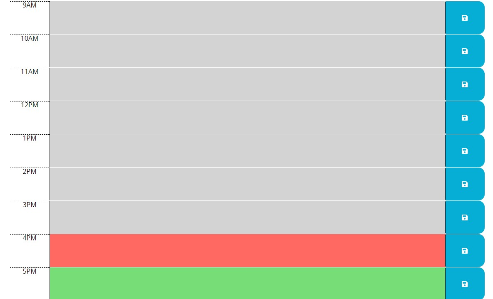

# Work Day Scheduler

## Objective

Create a simple calendar application that allows a user to save events for each hour of the day. This app will run in the browser and feature dynamically updated HTML and CSS powered by jQuery.

## Review

- Deployed application: [https://rogerscl116.github.io/work-day-scheduler](https://rogerscl116.github.io/work-day-scheduler)   
- GitHub repository: [https://github.com/rogerscl116/work-day-scheduler](https://github.com/rogerscl116/work-day-scheduler)

## Screenshots

### Header

### Body

